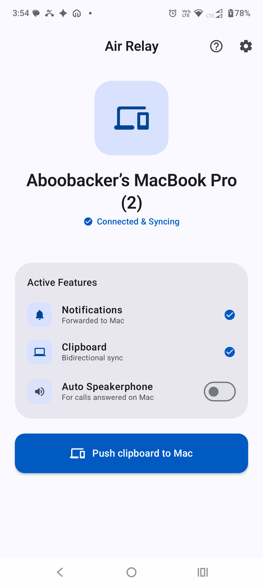
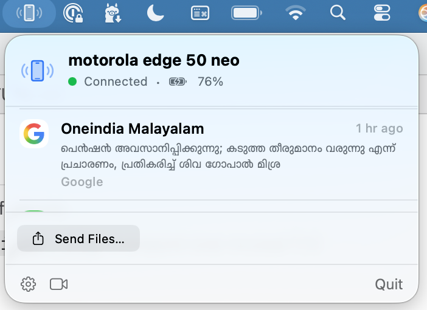

# Air Relay

Android ↔ macOS sync bridge for regular users, mimicking Apple Continuity features.

Peer-to-peer over the local network. Discovery via mDNS/Bonjour (`_syncbridge._tcp`),
transport over mutual TLS 1.3 with QR-code certificate pinning. No cloud, no accounts.

## Screenshots

| Android | macOS |
|---|---|
|  |  |

## Features

### Supported

| Feature | Continuity equivalent | Notes |
|---|---|---|
| Notification mirroring | iPhone notifications on Mac | Quick reply, actions, and dismissal sync both ways |
| Call notifications & control | Handoff calls | Answer/decline/hang up from the Mac; caller ID from contacts; speakerphone auto-enables on Mac-answer |
| Clipboard sync | Universal Clipboard | Bidirectional; Android → Mac needs a tap (Quick Settings tile or in-app button) due to Android 10+ background clipboard restrictions |
| File transfer | AirDrop | Both directions over LAN; received files land in Downloads/AirRelay; Finder "Send to Phone" service, drag & drop, Android share sheet |
| Camera preview | Continuity Camera (partial) | Live phone-camera preview window on the Mac (H.264 over the sync link) |
| Battery status | — | Phone battery level and charging state shown in the menu bar popover |
| Per-feature toggles | — | Notifications, calls, clipboard, and files can each be turned off on either device |

Every feature runs inside a single mutual-TLS 1.3 session pinned to the peer
certificate established during QR + code pairing.

### Missing

Feasible, not built yet:

| Feature | Continuity equivalent | Technical challenge |
|---|---|---|
| SMS from the Mac | Messages forwarding | Straightforward with Android SMS APIs (`SEND_SMS`, content provider for history); mostly protocol + UI work. Google Play policy restricts SMS permissions for store distribution |
| Media controls | — | Phone playback info/control via `MediaSessionManager`; reuses the notification-listener permission already granted |
| Find my phone | Find My | Trivial: a frame that makes the phone ring at full volume |
| Open URL on other device | Handoff (lite) | Trivial over the existing link; needs a share target on Android and a URL handler on the Mac |
| System virtual webcam | Continuity Camera | Streaming works; exposing it as a real macOS camera needs a CMIOExtension, which requires a paid Developer ID, notarization, and user approval in System Settings. Self-compiled builds can bypass this with `systemextensionsctl developer on`, at the cost of per-machine setup |
| Phone as Mac mic/speaker | — | Audio streaming is easy; appearing as a system audio device needs a CoreAudio HAL plug-in (AudioServerPlugIn). Unlike the camera, ad-hoc signing suffices (as BlackHole proves) — just needs to be built |
| Instant Hotspot | Instant Hotspot | Third-party apps cannot programmatically enable the hotspot; best achievable is showing signal/network status and deep-linking to the hotspot tile |
| Contact photos on call panel | — | Contact name lookup exists; photo lookup and transfer are incremental |

Hard or impossible with public APIs:

| Feature | Continuity equivalent | Why |
|---|---|---|
| Cellular call audio on the Mac | Handoff calls (audio) | Android restricts capture of call audio (uplink + downlink) to privileged pre-installed apps since Android 10, and macOS cannot act as a Bluetooth HFP hands-free unit with public APIs (IOBluetooth exposes RFCOMM, not SCO audio). Air Relay carries the control plane only — see [docs/ARCHITECTURE.md](docs/ARCHITECTURE.md) |
| Phone screen mirroring & control | iPhone Mirroring | Needs `MediaProjection` capture plus an accessibility service to inject input — heavyweight, permission-invasive, and against this project's "less is more" philosophy |
| Unlock Mac with phone | Auto Unlock | Requires a macOS authorization plugin running as root at the login window; fragile and unsupported territory |
| Cross-device keyboard/mouse | Universal Control | Needs OS-level input capture and injection on both sides; out of scope |
| Resume app state mid-document | Handoff (full) | Requires per-app cooperation on both platforms; not implementable generically by a bridge |

## Repository layout

| Directory | Contents |
|---|---|
| `android/` | Kotlin Android client (API 29+): foreground sync service, NSD discovery, notification listener, camera streaming engine |
| `macos/` | Swift 6 / SwiftUI menu bar app (macOS 14+): Bonjour listener, mTLS server, clipboard sync, VideoToolbox decoder, CMIOExtension virtual camera |
| `docs/` | Architecture and wire protocol specifications |

## Building

Everything is driven from the root `Makefile`:

```sh
make build          # both apps (debug)
make test           # all unit tests
make run-macos      # build + launch the menu bar app
make run-android    # build + deploy + launch on a connected device (android CLI)
make release        # release builds
make xcodeproj      # regenerate AirRelay.xcodeproj after editing project.yml
make doctor         # check the toolchain
```

Requirements:
- **Android**: Android SDK (compileSdk 37), JDK 21 (Android Studio's bundled
  JDK is picked up automatically), and the [`android` CLI](https://developer.android.com)
  for device deployment.
- **macOS**: full Xcode 16+, and [`xcodegen`](https://github.com/yonaskolb/XcodeGen)
  (`brew install xcodegen`) — `AirRelay.xcodeproj` is generated from
  `macos/project.yml` and not checked in. Open the project in Xcode for normal
  IDE development; SwiftPM library code lives in `macos/AirRelayKit/`.

The macOS app is ad-hoc signed for development. The virtual camera
CMIOExtension requires a paid Apple Developer account
(`com.apple.developer.system-extension.install` entitlement) and is not yet
part of the project.

## Documentation

- [docs/PROTOCOL.md](docs/PROTOCOL.md) — wire protocol, message schemas, pairing flow
- [docs/ARCHITECTURE.md](docs/ARCHITECTURE.md) — system decomposition and platform notes
